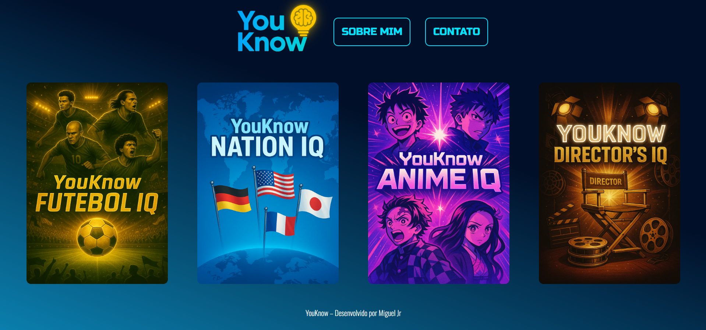
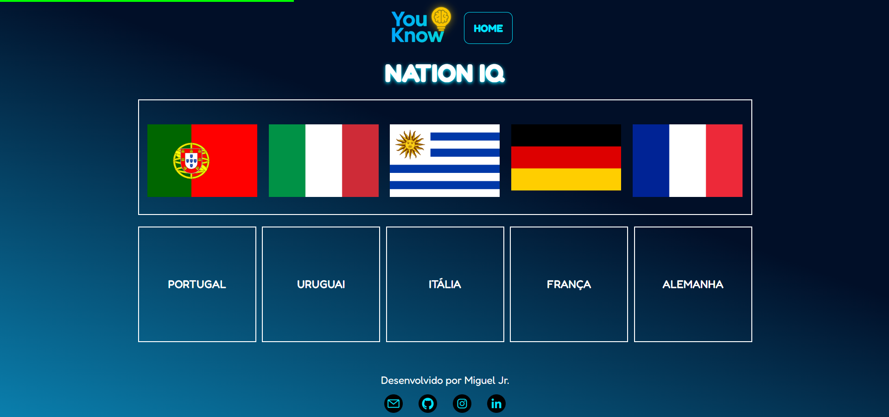
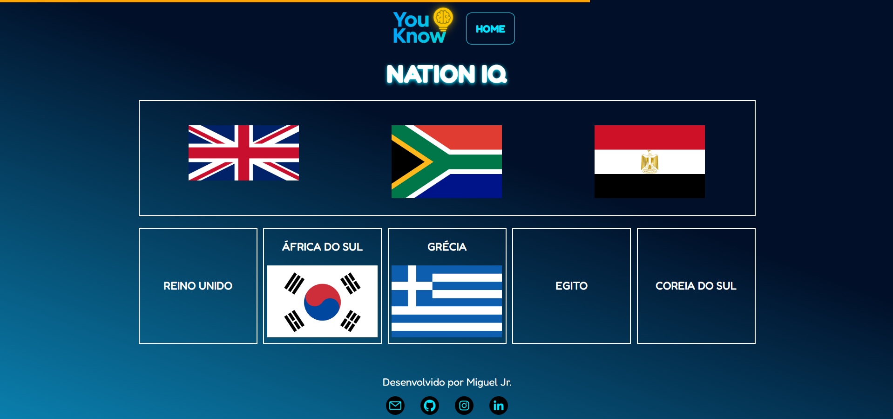
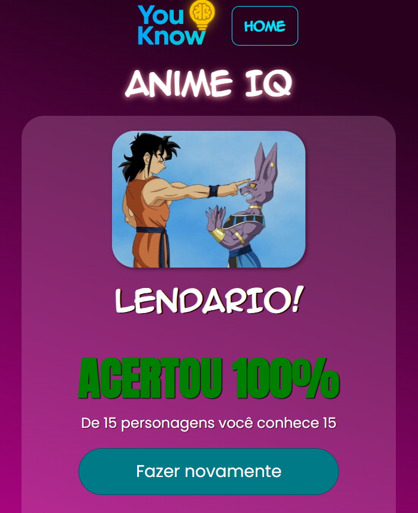

# 🧠 YouKnow: Series IQ

**YouKnow: Series IQ** é uma coleção de quizzes interativos, desenvolvida para testar seus conhecimentos em diferentes áreas da cultura pop, esportes, geografia e cinema!

Neste desafio, o foco é reconhecer personagens marcantes de diversas séries de quizzes. Arraste e solte os elementos corretos e prove o quanto você conhece!

## 🌟 Outras edições da coleção YouKnow

- ⚽ **Futebol IQ** – descubra se você realmente conhece os craques do futebol;
- 🎌 **Nation IQ** – teste seu conhecimento em geografia identificando as bandeiras dos países;
- 🎥 **Director’s IQ** – mostre que você domina os nomes por trás das grandes obras do cinema;
- 📺 **Anime IQ** – acerte quais são os personagens que marcaram os animes mais famosos.

Você conhece tudo isso? Então mostre que **YouKnow**!

## 🚀 Sobre o Projeto

**YouKnow: Series IQ** é um quiz que tem 4 temas  culturais diferentes, futebol, animes, diretores e países!

## 🧩 Funcionalidades

- ✅ Sistema de perguntas e respostas com **arrastar e soltar (drag-and-drop)**
- 📺 Perguntas baseadas em **séries famosas de diversos gêneros e épocas**
- ⭐ Avaliação final com **pontuação e comentários**
- 💬 Seção de feedback para os jogadores opinarem sobre o quiz
- 🔥 Design responsivo e visual limpo.

## 📁 Estrutura do Projeto

## 📸 Capturas de Tela

### 🖥️ Tela inicial do quiz

### 🎮 Quiz em ação

  
  

## 📫 Contato

Feito por [ Miguel Jr ]  
📧 Email: [ miguel.conta.jr@gmail.com ]  
🌐 Projeto: [ https://quiz-youknow.vercel.app ]

---

🎮 Divirta-se e desafie seus amigos! A cada acerto, você prova que **YouKnow** mesmo! 😉
